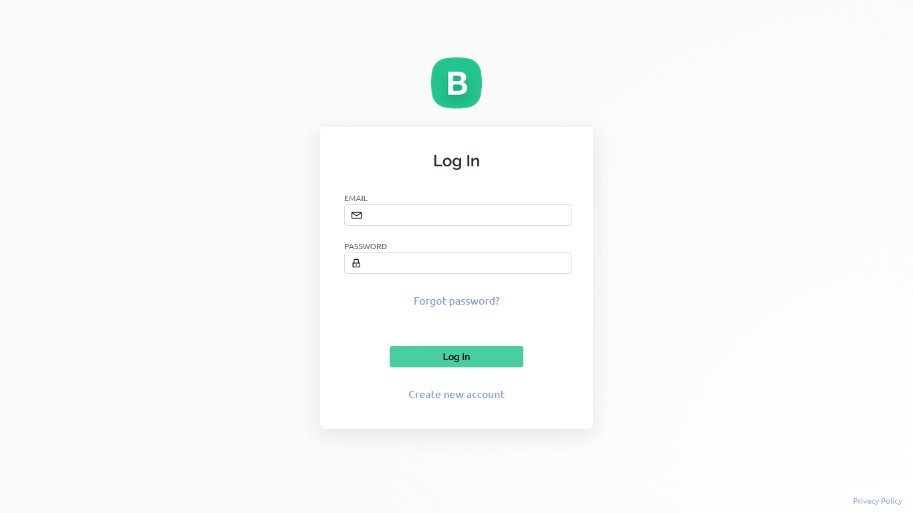

# Blynk-iot-dc-multimeter
#Blynk Login Page 

https://blynk.cloud/dashboard/login





#Blynk DashBoard


#CODE

```cpp
#define BLYNK_TEMPLATE_ID "TMPL35bnLsw5L"
#define BLYNK_TEMPLATE_NAME "DCpowerMETER"
#define BLYNK_FIRMWARE_VERSION "0.1.0"
```
These lines define some information related to the Blynk template used for the project, such as the template ID, template name, and firmware version.

```cpp
#include <Wire.h>
#include <Adafruit_INA219.h>
#include <Adafruit_SSD1306.h>
#include <BlynkSimpleEsp8266.h>
```
These lines include the necessary libraries required for the project. `Wire.h` is used for I2C communication, `Adafruit_INA219.h` is the library for the INA219 current sensor, `Adafruit_SSD1306.h` is for the OLED display, and `BlynkSimpleEsp8266.h` is for connecting to the Blynk cloud platform.

```cpp
#define SCREEN_WIDTH 128
#define SCREEN_HEIGHT 64
Adafruit_SSD1306 display(SCREEN_WIDTH, SCREEN_HEIGHT, &Wire, -1);  // Display 
Adafruit_INA219 ina219;   // INA219 Current Sensor
```
These lines define the screen dimensions for the OLED display and create instances of the `Adafruit_SSD1306` and `Adafruit_INA219` classes for controlling the OLED display and interfacing with the INA219 sensor, respectively.

```cpp
char ssid[] = "Type your SSID";   // SSID-wifi (or) Router Name
char pass[] = "Type your password";   // wifi (or) Router password
```
These variables store the Wi-Fi network credentials (`ssid` and `pass`). You need to replace `"Type your SSID"` and `"Type your password"` with your actual Wi-Fi network SSID and password.

```cpp
// Blynk Virtual Pins
#define LOADVOLTAGE_VIRTUAL_PIN V0    
#define CURRENT_VIRTUAL_PIN V1    
#define POWER_VIRTUAL_PIN V2
#define ENERGY_VIRTUAL_PIN V3
#define CAPACITY_VIRTUAL_PIN V4
#define ENERGYCOST_VIRTUAL_PIN V5
```
These are the virtual pins in the Blynk app where the data will be sent. You can use these virtual pins to display the corresponding data on the Blynk app.

```cpp
unsigned long previousMillis = 0;
unsigned long interval = 2000;
float shuntvoltage = 0.00;
float busvoltage = 0.00;
float current = 0.00;
float loadvoltage = 0.00;
float energy = 0.00, energyCost, energyPrevious, energyDifference;
float energyPrice = 6.50;      // price of the electricity
float power = 0.00;
float capacity = 0.00;
```
These variables are used for various calculations related to the INA219 sensor data and energy consumption. They store values like shunt voltage, bus voltage, current, load voltage, energy, energy cost, power, and capacity.

```cpp
void setup()
{
  // Setup code
}
```
The `setup()` function is called once when the microcontroller starts up or is reset. In this function, the serial communication is initialized, the INA219 sensor is calibrated to use a 32V, 2A range, the OLED display is initialized, and the Blynk connection is established.

```cpp
void loop()
{
  // Loop code
}
```
The `loop()` function is the main loop that runs continuously. In this function, the Blynk connection is maintained, and the sensor data is read and sent to the Blynk app and OLED display. The loop also includes a delay to control the frequency of data updates.

```cpp
void readAndSendDataToBlynk()
{
  // Calculation of all parameters
}
```
This function is responsible for reading sensor data from the INA219 sensor and calculating various parameters like load voltage, power, energy, capacity, and energy cost. It then sends this data to the Blynk app using virtual pins.

Sure, let's explain the `displaydata()` function line by line:

```cpp
void displaydata()
{
  display.clearDisplay();
  display.setTextColor(WHITE);
  display.setTextSize(1);
  display.setCursor(0, 5);     //Screen alignment point
  display.print(loadvoltage, 2);
  display.print(" V");
```
In this part of the code, the function `displaydata()` is defined. It starts by clearing the OLED display and setting the text color to white. It then sets the text size to 1 (normal size) and sets the cursor position to (0, 5), which is the starting point for displaying data on the OLED screen. It prints the `loadvoltage` variable with 2 decimal places followed by the text " V".

```cpp
// CURRENT
  if (current > 1000)
  {
    display.setCursor(60, 5);     //Screen alignment point
    display.print((current / 1000), 2);
    display.println(" A");
    display.setCursor(0, 15);     //Screen alignment point
    display.println("--------------------");
  }
  else
  {
    display.setCursor(60, 5);   //Screen alignment point
    display.print(current, 1);
    display.println(" mA");
    display.setCursor(0, 15);     //Screen alignment point
    display.println("--------------------");
  }
```
This part of the code handles displaying the current value on the OLED screen. If the current value is greater than 1000 (mA), it means the value is in Amperes (A), so it sets the cursor position to (60, 5) and prints the current value divided by 1000 with 2 decimal places (to convert it to Amperes) followed by the text " A". It then sets the cursor position to (0, 15) and prints a line of dashes "--------------------" as a separator.

If the current value is less than or equal to 1000 (mA), it means the value is in milliamperes (mA). So, it sets the cursor position to (60, 5) and prints the current value with 1 decimal place followed by the text " mA". It then sets the cursor position to (0, 15) and prints the same separator line "--------------------".

The purpose of this code is to display the load voltage and current on the OLED screen. If the current is greater than 1000 mA, it is displayed in Amperes (A); otherwise, it is displayed in milliamperes (mA). The separator line helps distinguish between different data on the OLED screen.

The `loop()` function calls these two functions to continuously update the Blynk app and OLED display with the latest sensor data.
